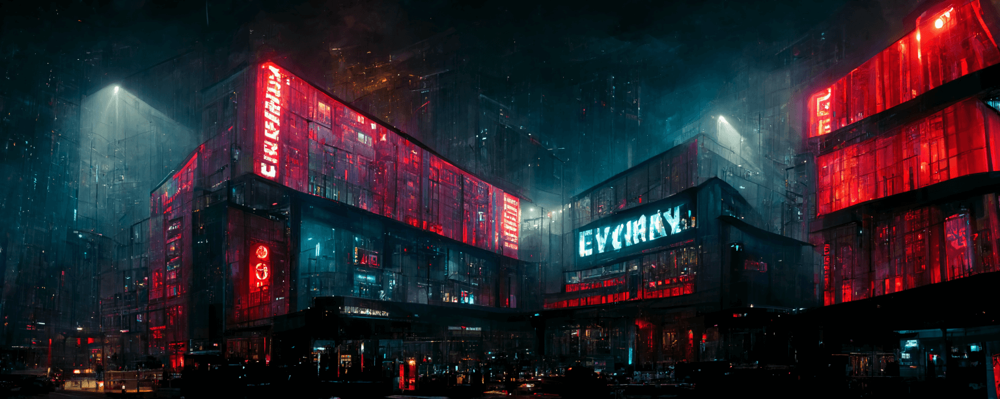

> ⚠️ Project is **archived** (April 2023).
>
> _The [Everyman Cinema](https://www.everymancinema.com) website was rebuilt
> in early 2023 to use [Gatsby](https://www.gatsbyjs.com), resulting in their 
> REST API being replaced. Scraping data via their new Gatsby API would be far 
> more brittle, compared to their old REST API; so I've decided to archive
> the project._

<p align="center">
  
</p>

# Everyman RSS

[](https://pkg.go.dev/github.com/revett/everyman-rss)
[](https://github.com/revett/everyman-rss/actions?query=branch%3Amain)
[](https://goreportcard.com/report/github.com/revett/everyman-rss)
[](https://codecov.io/gh/revett/everyman-rss)
[](https://github.com/revett/everyman-rss/blob/main/LICENSE)

RSS feeds for [Everyman Cinema](https://www.everymancinema.com) film releases.

## Why?

I wanted a feed of new film releases within my
[Inoreader](https://www.inoreader.com) client for my local cinema.


## Feeds

Each feed is an [RSS 2.0](https://www.rssboard.org/rss-specification) feed,
served over HTTPS.

### Cinema Feeds

You can get a feed of all new films for a specific Everyman Cinema:

```
https://everyman-rss.revcd.com/films?cinema=broadgate
```

See a list of all available cinemas
[below](https://everyman-rss.revcd.com/#cinemas).

### Caching

Feeds are cached for 5 minutes.

## Contributing

### OpenAPI Code Generation

Install [deepmap/oapi-codegen](https://github.com/deepmap/oapi-codegen):

```
go install github.com/deepmap/oapi-codegen/cmd/oapi-codegen@latest
```

Generate the code:

```
oapi-codegen -config oapi-codegen.yml everyman.openapi.yml
```

This is configured within `oapi-codegen.yml` and outputs to
`pkg/everyman/client.gen.go`.

## Credits

- Thanks to the [Everyman Cinema](https://www.everymancinema.com) team for the
  public API
- All images generated by [Midjourney](https://www.midjourney.com/showcase)

---

<p align="center">
  
</p>
